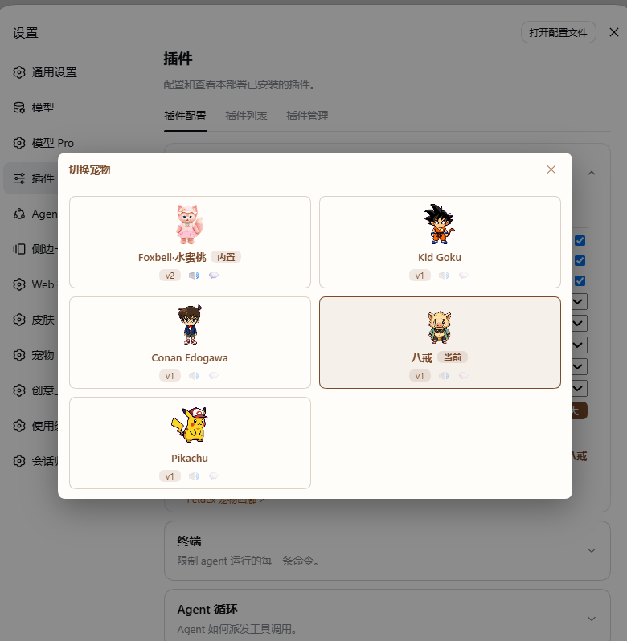
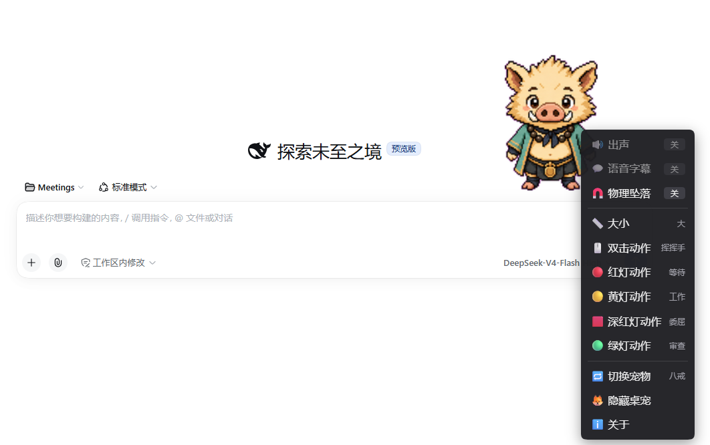
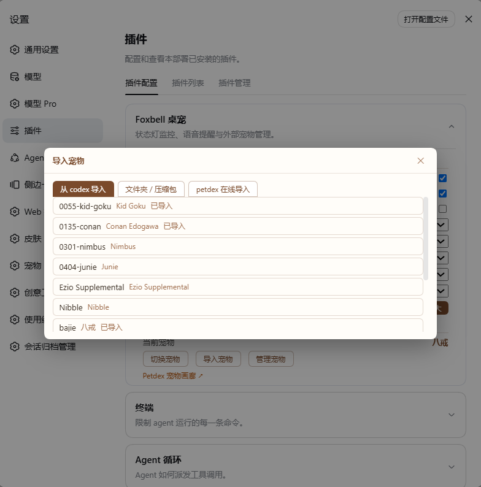

# dsh-foxbell-pet

[中文](README.md) · [English](README.en.md)

DeepSeek Harness（DSH）Web 网页右下角可拖拽的**多宠物桌宠系统**：多项目状态监控 + 语音提醒 + **外部宠物体系**（商店 / 四来源导入 / 热切换 / 完整性守卫）+ 🦊显隐开关。内置一只 Foxbell 小狐狸随包自带：**一键安装即用**，其余宠物随时导入、一键热切换。


> **v2.2.0 面向 dsh ≥ 0.1.2-rc.1**（rc.7/rc.8 等旧版不再支持，见下方兼容表；**0.1.5-rc.2 已逐项自检兼容**）。
> 状态卡片色彩语义自 v2.0.0 起切换为 MAM 口径（**红=待审批 / 黄=运行中 / 绿=完成未读 / 深红+⚠=错误断联**），与 v1.x（绿运行/黄待批准/红报错/蓝完成）不同，详见 [CHANGELOG](CHANGELOG.md)。

## 预览

**热切换**——内置宠物与导入宠物同场管理，点击即换、即时生效：



**右键菜单**——开关 / 大小 / 五场景动作绑定（实时预览）/ 切换宠物 / 隐藏 / 关于：



**四来源导入**——本地文件夹 / zip / Codex 宠物目录 / Petdex 在线仓库：



## 功能

- **多项目状态监控** —— 桌宠头顶为每个"活跃项目"显示一张状态卡片（MAM 色彩口径）：
  - 🔴 `approval` 等待审批（红）
  - 🟡 `running` 正在运行（黄）
  - 🟢 `done` 已完成未读（绿，点击即确认消失）
  - 🟥 `error` 本轮报错 / 断联（**深红 + ⚠ 标识**，与待审批红明确区分）
- **点卡片切换会话** —— 点击卡片直接切到该项目会话（`sessions.open`）并标记已读；错误/完成卡片点进去即消失，再次出现会重新亮起。
- **语音提醒** —— 完成播 `done` 组、待审批播 `approval` 组（10s 限流）、报错播 `error` 组；字幕=语音文件名，与音频时长对齐。
- **语音交互** —— 单击形象：只挥手（不出声）；双击形象：说话 + 「双击动作」；点卡片：只切换（不出声）。
- **状态驱动动画**（Codex V2 图集 11 行全用；外部宠物 v1 9 行图集运行时自适应）——
  动画优先级：**拖拽 > 瞬时动作 > 任务态 > 环视 > 待机**；拖动方向（左跑/右跑/上拎跳）、任务姿态（待审批→等待、运行→工作）、空闲 6s 环视 16 向扫视。
- **拖拽物理手感** —— 松手重力坠落（1400 px/s²）、水平抛掷惯性（150ms 采样窗）、落地压扁回弹 + 补跳（可关）；视口为工作区，位置记忆与边界钳制。
- **右键菜单** —— 🔊出声 / 💬语音字幕 / 🧲物理坠落 开关（无语音/无字幕宠物自动禁用带提示），📏大小三档，🖱️双击 / 🔴红灯 / 🟡黄灯 / 🟥深红灯 / 🟢绿灯 **五场景动作绑定（子页实时预览）**，**🔁切换宠物**（当前项打勾，点击即热切换），🦊隐藏桌宠，ℹ️关于。
- **外部宠物体系**（MAM v0.3.0 移植）——
  - 磁盘商店 `~/.dsh/foxbell-pet/pets/<id>/`；清单 v2（原子写 + `.bak` 备份）；
  - **四来源导入**：本地文件夹 / zip 包（宿主安全解压：总量 ≤100MB、文件数 ≤200、路径防穿越）/ Codex 宠物目录 `~/.codex/pets/` / **Petdex 在线仓库**（petdex.dev，列表与下载均由宿主代理：域名 allowlist、体积上限、8s 超时）；
  - **统一导入向导**：宠物 id 实时校验（字符集/长度/保留字 `foxbell`/查重/Windows 保留设备名，前后端双重校验）、显示名/描述、字幕开关、语音分组编辑（并行时长探测；1s<时长<20s 且 ≤10MB；四组齐全判定「有语音」）；
  - **管理对话框**：改名（id 同步目录与清单）、编辑显示名/描述、按组增删语音、字幕开关、**安全删除**（二次确认后移入 `~/.dsh/foxbell-pet/.trash/`，不物理删除）、查看目录路径；编辑激活中宠物自动闪切保护；
  - **热切换**：卡片式列表（内置 foxbell + 外部宠物）→ 激活即时生效（精灵/语音/清单热替换，无需刷新页面）；
  - **激活守卫**：激活与每次切换校验完整性（图集缺失/被改动、语音缺失/变动/多余、清单缺失），问题随状态快照下发，弹修复对话（更新清单 / 换回 foxbell / 忽略 / 隐藏宠物）；宠物本体运行中不弹；
  - **无语音宠物**：完成只播动画不出声、音效开关禁用带提示；**无字幕宠物**：不显示气泡。
- **三档缩放**（0.75 / 1 / 1.25）—— 作用于精灵/卡片/菜单整体（设置卡与右键菜单同款档位）。
- **设置卡（单卡双分区）** —— 「配置」区（声音/字幕/物理/五场景动作/大小）+「宠物管理」区（当前宠物、切换/导入/管理按钮、Petdex 入口）；与右键菜单读写同一份配置（localStorage + settings scope 双后端，Host 持久化到 `~/.dsh/settings.yaml`）。
- **🦊 显隐开关** —— 侧栏底部（语义与 v1 相同），状态存 localStorage。
- **错误码体系** —— 对齐 MAM PetError 码表（宿主 50 码 + 客户端本地 8 码），路由错误统一 `{code, params, detail}` JSON，客户端按插件内部 zh/en 字典映射文案、内联呈现于对话框（浏览器语言自动选择，不依赖 harness locale）。

## 效率看板（v2.1.0 移植）

v1.4.0 效率看板一期整体移植到 v2 架构：宿主聚合、随 `/state` 快照下发，**零新增常驻 UI**（迷你条仅悬停期间存在）；用量一律**纯 token 口径，不折算金额**，按**五口径**呈现——**请求输入 / 缓存命中 / 命中率 / 产出 / 你的输入(估)**（另标「含子代理」）。

1. **时长档位表盘**（节奏姿态引擎）—— 宠物姿态随事件时间轴自动变档：高强度 / 活跃 / **长任务**（turn 开着静默 ≥3 分钟，防挂机干等）/ 空闲 / **摸鱼四阶**（turn 关着静默 ≥15 分钟起小憩→躺平→咸鱼→咸鱼干渐进）。换动画变体、**不变速**，档位跃迁只播一次短动画，新事件立即复位。
2. **五口径迷你条** —— 悬停宠物 ≈0.5s 浮现：节奏表盘（当前档位读数）+「今日 × · 本会话 ×」五口径用量 +「N 等审批 / N 运行 / N 完成」状态行；唯一可点元素为尾部「详情 »」钻取按钮（容器仍不拦截点击），移开即消失（右键「🏷 今日用量」可手动唤出，点外部 / ESC 关）。
3. **警报举牌 + 看板音效链** —— 日阈值 `dayLimitTokens` 达 80% / 100% 各举牌一次「今日已消耗 X」，里程碑过 `milestoneUnit` 整数关口气泡一句话；警报音效自 v2.2.0 起走 **MAM 四组机制 + 默认音效**：宠物语音四组配齐时播 `general` 组，否则播内置合成提示音（三轮换）；TTS 不参与看板警报（`ttsEnabled` 仅用于台词朗读）。
4. **小黑板 + 📖 限时入口** —— 任务完成后宠物旁限时出现「📖 总结」入口（默认 15s，可配 10/15/20s）→ 点开浮现总结浮窗（会话 / turn / 五口径 token 三分账 / 工具 Top3 / 最长单 turn / 报错数），`boardTtlSec` 自动消失，✕ / 点外部 / ESC 均可关；右键「📊 查看最近总结」随时唤回。
5. **关宠 farewell** —— 隐藏桌宠时自动分发一次「今日收工」黑板，收工有交代。

两个小增强：**标题闪烁**——审批等待 ≥N 分钟（`approvalFlickerMin` 可配）且页面不可见时，标签页标题轮换「🦊 审批等待中…」，批准或回到页面即恢复；**年龄标注**——状态卡动态行尾灰色「×s/×m」，分清「刚发生」还是「已挂 5 分钟」。另有右键「🗂 会话一览」列出全部会话（状态色点 + 点击直达）。

以上共 **12 项新配置**（`paceEnabled` / `usageEnabled` / `summaryEnabled` / `ttsEnabled` / `dayLimitTokens` / `milestoneUnit` / `paceIntenseEvents` / `paceLongrunMin` / `paceLoafStartMin` / `approvalFlickerMin` / `summaryEntrySec` / `boardTtlSec`），设置卡**草稿 + 统一保存**（编辑先入草稿，保存/放弃统一生效，保存自动收起）。

### 效率看板交互速查（一目标一行为）

| 点击 / 操作目标 | 唯一行为 |
|---|---|
| 状态卡（单击） | 智能跳转：有待审批 → 审批锚点；否则 → 会话 + 已读 |
| 📖 总结限时入口 | 展开小黑板，入口随即消失 |
| 右键菜单新子项 | 今日用量 → 手动开迷你条；查看最近总结 → 展开黑板；会话一览项 → 智能跳转 |
| 悬停 ≈0.5s | 浮现迷你条（唯一可点元素=「详情 »」钻取按钮，移开即消失） |
| 拖拽 | 纯物理动画，**不承载命令**（期间迷你条隐藏、悬停检测挂起） |
| 滚轮 | 宠物本体与迷你条**不劫持**、穿透回页面；黑板 / 菜单内部正常滚动 |
| 右键 | **仅宠物本体**弹菜单（状态卡与各浮层右键无自定义行为） |
| ESC | 一次剥一层最上层浮层（手动迷你条 → 黑板 → 菜单） |
| 黑板 vs 迷你条 | **互斥顶替**：黑板开着时迷你条消失，黑板关闭后迷你条恢复 |

## 用量看板（v2.2.0，三级披露）

一个数据核、三级呈现，越点越深：**L1 迷你条 → L2 小黑板 → L3 主列大看板**（另有右键「📈 用量看板」直达）。宿主一次聚合（会话事件 usage 按日/小时/路由/工具折叠），随 `/state` 快照与按需路由下发；**纯 token 口径，无任何金额字段**；性能上按「末事件指纹」增量缓存 + `/state` 短路 + 页面不可见降频，空闲开销近乎为零。

- **L2 小黑板加料**：五口径明细之后追加 **7 日 sparkline**、**模型 Top3** 与「**查看完整看板 →**」入口行；黑板锚定宠物侧（左优先、越界自动翻右），出现即顶替迷你条。
- **L3 大看板**（复刻 Codex++ 排版，占主列）：选项卡【近 5 小时 | 近 7 天 | 近 30 天 | 自定义 ≤31 天】+「复制文本」「导出图片」；区间 hero 大数字 + 本周/上周命中率对比；五口径网格；蓝→紫渐变趋势图（hover tooltip / 数据点 / 峰值 / 轴标签）；**模型分布**通栏进度条（≤6 行）；2×2 工具格 + Top5 工具；底部口径说明。
- **模型/供应商分布**（F05 清偿）：按 (turn, step) 结算样本的 `provider/model` 路由记账（同槽替换冲回、跨日不污染）；聚合结果已与会话官方 tokenUsage totals 四口径逐字节对账。
- **导出分享**：1200×675 PNG——标题 / hero / 趋势折线 / 口径网格 / 模型行 + 底部当前宠物立绘（姿态随机或自选）+ 智能评语气泡（规则池 zh/en 优先级匹配，或设置卡自定义模板 `{range}` `{tokens}` `{hitPct}` `{models}`）；「复制文本」为同数据纯文本摘要。
- **看板音效**：警报（日阈值 / 里程碑）四组配齐播 `general` 组语音，否则播内置合成提示音（`/sounds/` 路由）。
- 设置卡新增 **3 项**：「侧栏看板入口」（默认关，开启后侧栏出现看板图标）、「导出评语」、「导出姿态」。

## 环境要求（兼容表）

| 组件 | 要求 |
|---|---|
| DeepSeek Harness（DSH） | **≥ 0.1.2-rc.1**（Web profile，`dsh web`） |
| rc.1 依赖面 | `session.snapshotEvents()`（B1）、`ctx.settings.installSection`（B2）、`dsh.client.inject` 包级依赖边语义（B3，本插件声明为空——只用平台种子模块 react） |
| master（0.1.3-alpha.1） | 静态 diff 评估无破坏面（详见 IMPLEMENTATION_NOTES §9） |
| 0.1.5-rc.2 | 协议面（事件/路由/settings）逐项自检兼容（v2.1.0 发布前回归） |
| v1.x（rc.7/rc.8 时代） | **不支持**（旧 `session.events` / `installSettingsSection` / `dsh-client-runtime` 在 rc.1 已删除；请使用本插件 v1.3.0） |

内置素材随包自带，无需额外下载；外部宠物素材由用户导入。

## 安装（一键）

```sh
dsh plugin --profile web add github:jarvislee90s-dot/dsh-foxbell-pet
> 构建白名单提示：v2 起安装会执行 `prepare`（esbuild 构建）。dsh profile 使用 pnpm 时，
> 首次安装需在 profile 的 allowBuilds 白名单放行本插件的构建脚本（pnpm approve-builds
> 或 profile 配置），否则产物 `lib/` 不会生成。
```

然后**重启 `dsh web`** 并**硬刷新浏览器**（Cmd/Ctrl+Shift+R）。右下角即出现桌宠，设置旁有 🦊 开关，设置页出现「foxbell-pet」配置卡。

> 桌宠运行时从插件包自带目录 `assets/` 读取内置精灵图/语音；外部宠物商店在
> `~/.dsh/foxbell-pet/`（插件专属目录，首次启动自动创建）。

## 使用

| 交互 | 效果 |
|---|---|
| 拖动 | 任意移动桌宠（方向动画：左跑/右跑/上拎跳） |
| 拖拽后松手 | 重力坠落 / 抛掷惯性 / 落地压扁回弹 + 补跳（可关「物理坠落」） |
| 右键桌宠 | 菜单：开关 / 大小 / 五场景动作绑定（实时预览）/ 切换宠物 / 隐藏 / 关于 |
| 单击形象 | 固定挥手（不出声） |
| 双击形象 | 随机说一句 + 「双击动作」（字幕=语音文件名） |
| 点项目卡片 | 切换会话 + 标记已读（绿卡点击即确认消失） |
| 🦊 按钮（侧栏底部） | 显示 / 隐藏桌宠 |
| 设置卡「宠物管理」 | 切换 / 导入 / 管理宠物、Petdex 画廊入口 |

状态灯（MAM 口径）：**红** 待审批 · **黄** 运行中 · **绿** 完成未读 · **深红+⚠** 报错/断联。

## 语音分组

`voice/` 按状态分 4 个固定分组（内置素材在包内 `assets/voice/`，外部宠物在
`~/.dsh/foxbell-pet/pets/<id>/voice/`），文件名即字幕文字：

| 文件夹 | 触发时机 | 说明 |
|---|---|---|
| `general/` | 双击形象 | 闲聊（随机、组内不连续重复） |
| `approval/` | 出现待审批（红灯） | 撒娇催促，10s 限频防刷屏 |
| `error/` | 任务报错（深红灯） | 委屈/傲娇台词 |
| `done/` | 任务完成（绿灯） | 求夸/元气台词 |

运行（黄）不播语音。空组静默跳过；四组齐全才判定宠物「有语音」能力。

## 自定义（外部宠物）

- **导入**：设置卡 →「导入宠物」→ 四来源任选（文件夹 / zip / codex / petdex 链接或搜索）→ 向导配置（id/显示名/描述/字幕/语音分组）→ 执行导入 → 立即激活。
- **素材规格**：Codex V2 图集 `spritesheet.webp`（8 列；11 行 1536×2288 = v2，9 行 1536×1872 = v1，运行时自适应），见 [docs/SPRITESHEET-CONTRACT.md](docs/SPRITESHEET-CONTRACT.md)；语音 `.m4a/.mp3/.wav/.ogg/.opus/.flac/.aac`，单条 1–20s 且 ≤10MB。
- **换形象不换语音**：管理对话框按组增删语音后「保存修改」（清单自动备份更新）。

## 开发

```sh
npm install
npm run build      # esbuild：src/host → lib/index.js（ESM），src/client → lib/client.js（单文件 iife）
npm run validate   # 静态校验（既有检查 + 产物纯度 / 声明一致 / 路由前缀 / 版本 / 错误码表 / 内置清单）
npm run typecheck  # tsc --noEmit（客户端 TSX）
npm test           # vitest（纯逻辑 + 真实临时目录管线 + mock fetch）
```

```
dsh-foxbell-pet/
├── assets/         内置 foxbell 素材（精灵图 + 31 条语音 + v2 清单 pet.json）
├── lib/            发布产物（main 与 ./client 入口；esbuild 生成，随包提交）
├── src/host/       宿主半源码（纯 JS：状态聚合/商店/导入/守卫/路由族）
├── src/client/     客户端半源码（TSX：本体/菜单/设置卡/对话框/错误码字典）
├── test/           vitest 套件（含真实临时目录与 mock fetch）
├── scripts/        构建 + 校验 + 内置清单生成
├── docs/           图集规格 / QA 清单 / 截图 / 历史设计文档
├── demo/           独立离线预览页
├── package.json  dsh.plugin.json  cordis.patch.yml
├── IMPLEMENTATION_NOTES.md   决策记录 / MAM 对齐索引表 / 前向风险评估
└── README.md  README.en.md  LICENSE  CHANGELOG.md
```

本机开发安装：`dsh plugin --profile web add <仓库路径>` 装的是 symlink；改完 `src/` 后
`npm run build`，**重启 `dsh web`** 并硬刷新浏览器即生效。

## License

[MIT](LICENSE)
