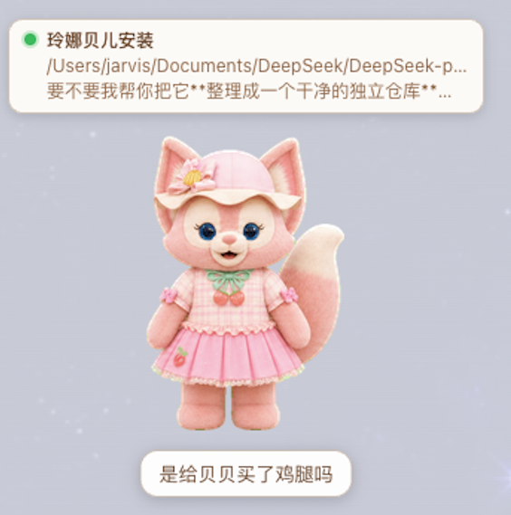

# dsh-foxbell-pet

[中文](README.md) · [English](README.en.md)

DeepSeek Harness（DSH）Web 网页右下角可拖拽的 **Foxbell 小狐狸桌宠**：多项目状态监控 + 完成语音提醒 + 🦊显隐开关。素材随包自带：**一键安装即用，无需手动放素材**。



## 功能

- **多项目状态监控** —— 桌宠头顶为每个"活跃项目"显示一张状态卡片，带状态灯：
  - 🟢 `running` 正在运行
  - 🟡 `approval` 有待批准
  - 🔴 `error` 本轮报错 / 断联
  - 🔵 `done` 已完成未读
- **点卡片切换会话** —— 点击项目卡片直接切到该项目会话（左侧栏 + 中间区，`sessions.open`）并标记已读；红灯/已完成卡片**点进去即消失**，再次报错会重新亮红。
- **完成语音提醒** —— 任意项目完成时随机播 `voice/*.m4a` + 高兴跳跃 + 字幕（字幕与语音时长对齐）。
- **语音交互** —— 单击形象：只挥手（不出声）；双击形象：说话 + 挥手；点项目卡片：只切换（不出声）。
- **状态驱动动画**（Codex V2 图集 11 行全用）—— 动画随交互与任务状态变化：
  - 拖动方向：左拖**向左跑**、右拖**向右跑**、上拖**跳跃**；
  - 任务状态：任一项目**报错**→委屈动画、**完成**→高兴跳跃、**待批准**→等待姿态、**完成未读**→审查姿态、当前会话运行→工作姿态；
  - 空闲时**东张西望**（look 行 9→10 连续 16 帧从左到右播一圈）。
- **🦊 显隐开关** —— 侧栏底部设置图标旁的开关（类似 Codex 的宠物开关），状态存 `localStorage`。
- **卡片等宽** —— 项目气泡为多行卡片（加粗标题 + 状态点，第二、三行显示最新运行状态），横向等宽对齐。

## 环境要求

- DeepSeek Harness（DSH）Web profile（`dsh web`）。
- 素材已随包自带，无需额外下载。

## 安装（一键）

```sh
dsh plugin --profile web add github:jarvislee90s-dot/dsh-foxbell-pet
```

然后**重启 `dsh web`** 并**硬刷新浏览器**（Cmd/Ctrl+Shift+R）。右下角即出现桌宠，设置旁有 🦊 开关。

> 桌宠运行时从插件包自带目录 `assets/` 读取精灵图/语音，无需手动放置。

## 使用

| 交互 | 效果 |
|---|---|
| 拖动 | 任意移动桌宠 |
| 单击形象 | 只挥手（不出声） |
| 双击形象 | 随机说一句 + 挥手（字幕=语音文件名，与播放对齐） |
| 点项目卡片 | 切换会话 + 标记已读（不出声） |
| 🦊 按钮（侧栏底部） | 显示 / 隐藏桌宠 |

状态灯：**绿** 运行 · **黄** 待批准 · **红** 报错/断联 · **蓝** 完成未读。done 与 error 卡片在打开对应会话后消失；状态再次出现会重新亮起。

> ⚠️ 黄灯仅在审批策略为 `ask` 且确有等待批准的请求时出现；`never` 策略下审批自动拒绝，不会挂黄灯（符合语义）。

## 自定义

- **换语音**：把 `.m4a`/`.mp4` 放进已装包的 `assets/voice/`，文件名就是字幕文字；重装/重启后生效。
- **换形象**：替换 `assets/spritesheet.webp`（Codex V2 图集规格：8 列 × 11 行，每帧 192×208，行 0–8 为动画）。见 [docs/SPRITESHEET-CONTRACT.md](docs/SPRITESHEET-CONTRACT.md)。
- **改样式/截断**：改 `lib/client.js` 的 CSS、`lib/index.js` 里的 `truncate(…, 24)`，然后 `npm run build` 并重启。

## 开发

```sh
npm run build     # src/ → lib/（纯 JS，无需转译）
npm run validate  # 校验：语法 / JSON / 禁用词 / 素材
```

```
dsh-foxbell-pet/
├── assets/         精灵图 + 语音（随包发布，运行时读取）
├── lib/            发布版 host/client（main 与 ./client 入口）
├── src/            源码（同款纯 JS；build 拷贝到 lib/）
├── reference/      形象参考图
├── docs/           图集规格说明
├── scripts/        构建 + 校验脚本
├── demo/           独立预览页
├── package.json  dsh.plugin.json  cordis.patch.yml
└── README.md  README.zh.md  LICENSE  CHANGELOG.md
```

## License

[MIT](LICENSE)
